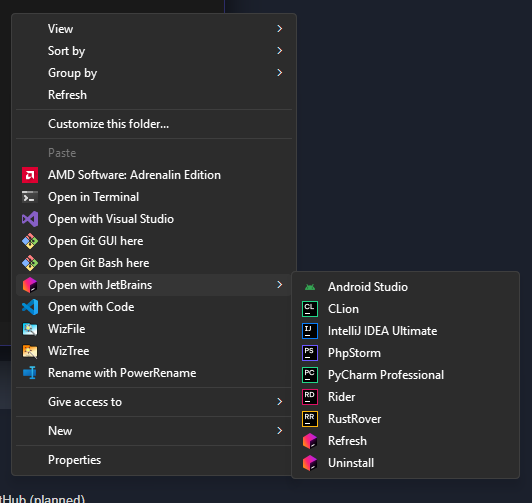

# JetBrains Toolbox Context Menu Generator

A cross-platform utility that adds context menu integration for JetBrains IDEs installed through the JetBrains Toolbox.

## Features

- Scan for JetBrains Toolbox installations
- Add context menu entries for installed JetBrains IDEs
- Remove context menu entries
- Cross-platform support (Windows, macOS, Linux)
- Quiet mode for scripting
- Verbose mode for debugging

## Installation

### Prerequisites

- Rust 1.82.0 or later
- JetBrains Toolbox installed on your system

### Building from Source

```bash
cargo build --release
```

The compiled binary will be available in `target/release/`.

## Usage

### Basic Commands

```bash
# Scan and add context menu entries
jetbrains-toolbox-context-menu scan

# Remove context menu entries
jetbrains-toolbox-context-menu uninstall

# Show help
jetbrains-toolbox-context-menu --help
```

### Command Line Options

#### Global Options
- `--quiet`, `-q`: Suppress all output except errors and formatted responses
- `--verbose`, `-v`: Output additional debugging information

#### Subcommands
- `scan`: Scans for JetBrains Toolbox installations and adds context menu entries
- `uninstall`: Removes the context menu entries for JetBrains Toolbox installations

#### Future Options (Implementation in Progress)
- `update`: Downloads the latest version from GitHub
  - `--force`, `-f`: Force download even if versions match
  - `--dry-run`: Show version info without downloading
  - `--all`: Output all releases (requires --dry-run)
  - `--style`, `-s`: Output format (JSON, YAML, PlainText)

## Platform Support

- Windows: Full support with registry integration
- macOS: Not Supported Yet
- Linux: Not Supported Yet (Dolphin integration)

## Dependencies

- anyhow 1.0.95
- tokio 1.43.1
- clap 4.5.21
- serde_json 1.0.66
- winreg 0.55.0 (Windows only)
- pretty_env_logger 0.5.0
- serde 1.0.215
- log 0.4.22
- winapi 0.3.9 (Windows only)
- atty 0.2.14 (Windows only)
## Screenshots


## Contributing

Contributions are welcome! Please feel free to submit a Pull Request.

## Building from Source

1. Clone the repository
2. Run `cargo build --release`
   - Optionally run `cargo packager --release` to build the nsis installer using `cargo-packager` cli
3. The binary will be available in `target/release/`

## Troubleshooting

If you encounter any issues, try running the application with the `--verbose` flag to get more detailed output:

```bash
jetbrains-toolbox-context-menu --verbose scan
```

## Future Plans

- Update feature for downloading the latest version from GitHub (implementation in progress)
- Additional output format options (JSON, YAML, Plain Text) (implementation in progress)
